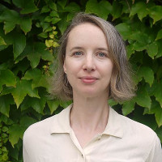

# Early Bird Registration Is Now Open for Online Northwest 2018!

We are delighted to announce that registration is now open for Online Northwest 2018! Please join us this year on March 30th, 2018 at Portland State University for a program that includes presentations on privacy, OERs, user testing, and tools for effective instruction.

## [Register Today!](https://commerce.cashnet.com/pdxLIBRARY_CONF)

Registration costs are below, and include morning and afternoon snacks as well as lunch Early bird registration is $100, open until February 22nd, 2018
Registration after February 22nd is $135

The full program and schedule are available at [https://pdxscholar.library.pdx.edu/onlinenorthwest/2018/](https://pdxscholar.library.pdx.edu/onlinenorthwest/2018/)

Questions? Contact Portland State University Library at [psulib@pdx.edu](mailto:psulib@pdx.edu)

# Online Northwest 2018 Keynote Speaker  

## Danielle Robinson  

Danielle Robinson is an open science advocate and enthusiast who believes in the power of inclusive open communities. Danielle received her PhD in Neuroscience from Oregon Health and Science University in 2017, and a National Science Foundation Graduate Research Fellowship in 2012. She was a 2016-2017 Mozilla Fellow for Science, and her fellowship was mentored by Robin Champieux at the OHSU Library. During this fellowship, Danielle was able to focus on some of the complex issues being tackled by libraries today, like Data Rescue (including attending the LIbraries+Network meeting in DC). In collaboration with OSHU library, she continues to develop the open science community at OHSU, in the Portland region, and beyond through library-sponsored projects and events like [Open Insight](http://openinsightpdx.com/), [Science Hack Day PDX](http://portland.sciencehackday.org/), [DataRescue PDX](https://github.com/daniellecrobinson/Data-Rescue-PDX), [Working Open Workshop Portland](https://daniellecrobinson.github.io/mini-wow-pdx/), [Radian Data](http://radiandata.org/), and the [BioData Club](https://biodata-club.github.io/).  

Danielle is the Co-Executive Director at Code for Science & Society where she works to support open source software projects including the [Dat project](https://datproject.org/), [Stencila](https://stenci.la/), and [ScienceFair](http://sciencefair-app.com/). She is passionate about applying the philosophy of open source software development to scientific research to improve efficiency and research reproducibility, and working for an inclusive future for science and scholarship.  

She is also a founding member of [Women in Science Portland](https://womeninsciencepdx.org/) where she currently serves as the Communications Chair. She is active in the OpenCon, Mozilla Open Leadership, DataRescue, and Science Hack Day communities and always interested in talking about improving public access to research and data. Please save the date - the OHSU Library will present OpenCon Cascadia on March 23-24 2018 in PDX! Danielle and the rest of the organizing team are planning a  program around exploring the relationships between open scholarship, diversity, and inclusion in critical and meaningful ways.  

