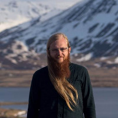

# Online Northwest 2018 Keynote Speakers  

Danielle Robinson and Max Ogden are currently working on an initiative with California Digital Library to build open source tools for researchers in the University of California system to publish reproducible software and data 'containers'. This builds on what they learned in their attempt to discover and back up federal climate data and Data.gov. They decided they needed to 'go upstream' to find out if they can build better data sharing tools that researchers can use while they are working on their research, because as Max and Danielle learned during their Data.gov backup, if the data is not published with good metadata and other practices up front, it becomes very difficult to discover and archive later on.  

## Danielle Robinson  

Danielle Robinson is an open science advocate and enthusiast who believes in the power of inclusive open communities. Danielle received her PhD in Neuroscience from Oregon Health and Science University in 2017, and a National Science Foundation Graduate Research Fellowship in 2012. She was a 2016-2017 Mozilla Fellow for Science, and her fellowship was mentored by Robin Champieux at the OHSU Library. During this fellowship, Danielle was able to focus on some of the complex issues being tackled by libraries today, like Data Rescue (including attending the LIbraries+Network meeting in DC). In collaboration with OSHU library, she continues to develop the open science community at OHSU, in the Portland region, and beyond through library-sponsored projects and events like [Open Insight](http://openinsightpdx.com/), [Science Hack Day PDX](http://portland.sciencehackday.org/), [DataRescue PDX](https://github.com/daniellecrobinson/Data-Rescue-PDX), [Working Open Workshop Portland](https://daniellecrobinson.github.io/mini-wow-pdx/), [Radian Data](http://radiandata.org/), and the [BioData Club](https://biodata-club.github.io/).  

Danielle is the Director of Partnership at Code for Science & Society where she works to support open source software projects including the [Dat project](https://datproject.org/), [Stencila](https://stenci.la/), and [ScienceFair](http://sciencefair-app.com/). She is passionate about applying the philosophy of open source software development to scientific research to improve efficiency and research reproducibility, and working for an inclusive future for science and scholarship.  

She is also a founding member of [Women in Science Portland](https://womeninsciencepdx.org/) where she currently serves as the Communications Chair. She is active in the OpenCon, Mozilla Open Leadership, DataRescue, and Science Hack Day communities and always interested in talking about improving public access to research and data. Please save the date - the OHSU Library will present OpenCon Cascadia on March 23-24 2018 in PDX! Danielle and the rest of the organizing team are planning a  program around exploring the relationships between open scholarship, diversity, and inclusion in critical and meaningful ways.  

## Max Ogden  

Max Ogden is the founder of[ Code for Science & Society](https://codeforscience.org/), a non-profit dedicated to building open source technologies for accelerating data intensive research and civic data sharing. He is based in Portland, OR and is an amateur cat photographer. Max maintains open source software and is active in community organizing open source events, such as the [CSV Conference](https://csvconf.com/) (@csvconf).  
 

&nbsp;

